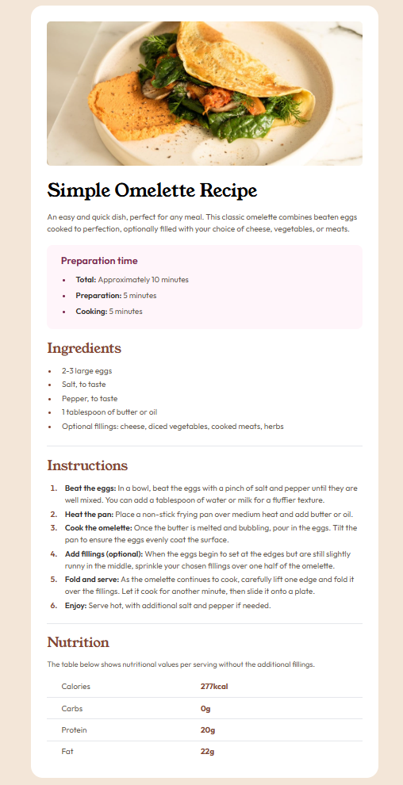

# Frontend Mentor - Recipe page solution

This is a solution to the [Recipe page challenge on Frontend Mentor](https://www.frontendmentor.io/challenges/recipe-page-KiTsR8QQKm). Frontend Mentor challenges help you improve your coding skills by building realistic projects.

## Table of contents

- [Overview](#overview)
  - [The challenge](#the-challenge)
  - [Screenshot](#screenshot)
  - [Links](#links)
- [My process](#my-process)
  - [Built with](#built-with)
  - [What I learned](#what-i-learned)
  - [Continued development](#continued-development)
  - [Useful resources](#useful-resources)
  - [AI Collaboration](#ai-collaboration)
- [Author](#author)

## Overview

### Screenshot



### Links

- Solution URL: [Add solution URL here](https://github.com/denissoboslai13/frontend-mentor-recipe-page/blob/main/index.html)
- Live Site URL: [Add live site URL here](https://your-live-site-url.com)

## My process

### Built with

- Semantic HTML5 markup
- Flexbox
- Mobile-first workflow
- Tailwind CSS

### What I learned

Alright, personally i think this is quite a bit of a step up from the previous challenges, but i think i did well. I learned how to work with both ordered and unordered lists, aswell as tables, so im not so clueless about them now. Also i learned how to do responsive design in tailwind (responsive design in general), where the design does differ quite a bit on desktop and mobile.

```html
<div class="-mx-8 -mt-8 sm:mx-0 sm:my-0">
  
</div>
```

### Continued development

I assume responsive design will be at the forefront for the future challenges, so i want to keep working on that and experimenting more, other than that i think the list markers coudlve been done better (maybe a custom pseudo element), but im not really sure how to do them just now, so thats also something i want to learn for the future.

### Useful resources

- [Tailwind Docs](https://tailwindcss.com/) - Still had to lookup some stuff
- [W3Schools list bullets](https://www.w3schools.com/howto/howto_css_bullet_color.asp) - Good for styling your list markers
- [W3Schools Tables](https://www.w3schools.com/css/css_table.asp) - Gave me a recap of how tables work and what properties they have

### AI Collaboration

Okay, this is the first challenge where i did have to use AI, which isnt the greatest, but i used it for one thing only, and thats the responsive design, obviously on desktop the image has padding, just like the rest of the content, but on mobile it doesnt, it goes to the edges, and i wasnt sure how to do that. So i asked claude, and he pointed me towards the "sm" and "md" selectors in tailwind, which i eventually made work.

## Author

- Frontend Mentor - [@denissoboslai13](https://www.frontendmentor.io/profile/denissoboslai13)
